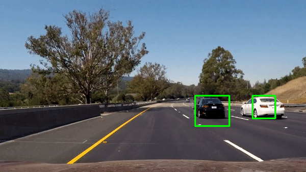
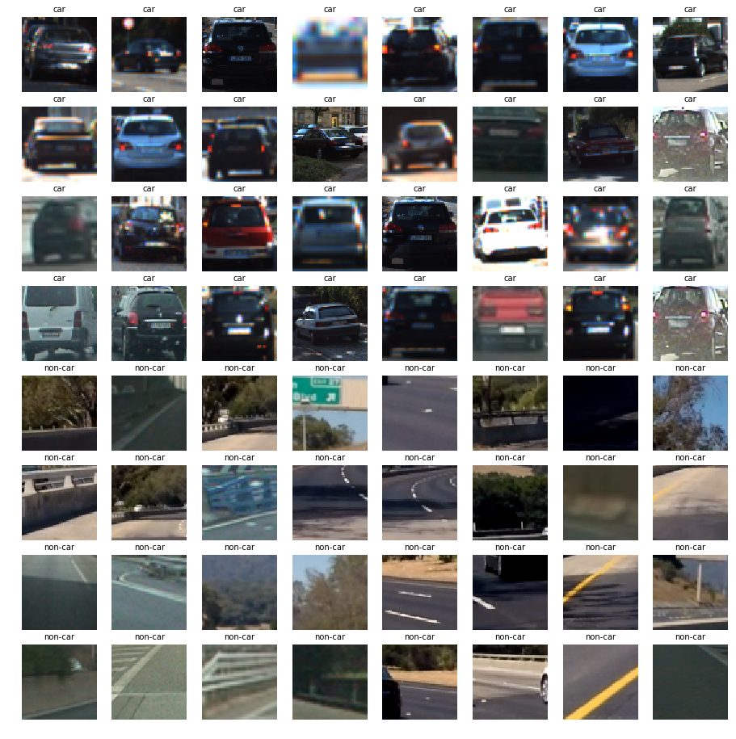
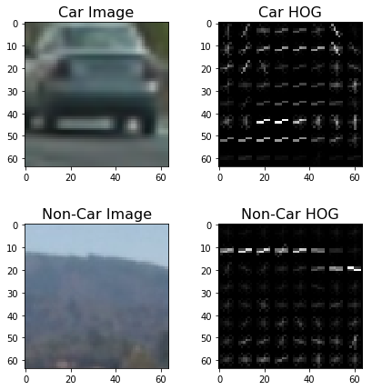

# Udacity Self Driving Car Nano Degree Project 5: Vehicle detection and tracking


---
## Project Goals

Main goal of this project is to create a software pipeline to detect and track vehicles in a video stream from a front facing camera of a car using computer vision and Machine Learning using the following steps:

1. Perform a Histogram of Oriented Gradients (HOG) feature extraction on a labeled training set of images and train a Linear SVM classifier. Optionally, you can also apply a color transform and append binned color features, as well as histograms of color, to your HOG feature vector.
2. Implement a sliding-window technique and use your trained classifier to search for vehicles in images.
3. Run your pipeline on a video stream (start with the test_video.mp4 and later implement on full project_video.mp4) and create a heat map of recurring detections frame by frame to reject outliers and follow detected vehicles.
4. Estimate a bounding box for vehicles detected.

The steps that I followed in this project are the following:

**Step 1:** Define helper functions and load Training data and Visualize some sample images.       
**Step 2:** Convert Image to HOG (Histogram of Oriented Gradients) and Visualize them using helper functions.          
**Step 3:** Extract Features for Input Datasets and Combine, Define Labels Vector, Shuffle and Split training data into training and testing sets.                 
**Step 4:** Pick a best combination of Color Space, Orientations, Pixels per cell to use in extracting the image features and train a classifier using SVM.                   
**Step 5:** Define methods to find cars using the Classifier and searching in the ROI, Apply Heatmap and thresholds to identify false positives, Draw bounding boxes around identified vehicles.                
**Step 6:** Build a pipeline combining the methods mentioned in step 5 and test it on sample images.           
**Step 7:** Define a class to store the identified bounding boxes from the previous video frame, build a pipeline for processing video frames.               
**Step 8:** Run the video through the pipeline.            

I have used the following software/libraries in this project

1. Python 3.5
2. Numpy
3. OpenCV
4. Matplotlib
5. Moviepy
6. SciKit
7. SciPy

## Detailed explanation of the steps followed

In this section I will go through each of the steps that I followed in this project.

### Step 1: Define helper functions and load Training data and Visualize some sample images

In this step I have defined functions ```get_hog_features``` ```bin_spatial``` and ```color_hist``` for features extraction (HOG, binned color and color histogram features) 

### Step 2: Convert Image to HOG (Histogram of Oriented Gradients) and Visualize them using helper functions

I have started by loading the training data and checked the number of images in both Cars and Non-Cars Classes and found that the number of images in both the classes are approximately same and hence no need for further data augumentation. Then I Visualized some sample images from both the classes.



**Explain how (and identify where in your code) you extracted HOG features from the training images.**

Then I have used the method ```get_hog_features``` using the following code snippet to extract hog features for a sample car image and non-car image. The figure below shows a comparison of a car image and its associated histogram of oriented gradients, as well as the same for a non-car image.

```
car_img = mpimg.imread(car_images[25])
_, car_dst = get_hog_features(car_img[:,:,2], 9, 8, 8, vis=True, feature_vec=True)
noncar_img = mpimg.imread(noncar_images[25])
_, noncar_dst = get_hog_features(noncar_img[:,:,2], 9, 8, 8, vis=True, feature_vec=True)

# Visualize 
f, ((ax1, ax2), (ax3, ax4)) = plt.subplots(2, 2, figsize=(7,7))
f.subplots_adjust(hspace = .4, wspace=.2)
ax1.imshow(car_img)
ax1.set_title('Car Image', fontsize=16)
ax2.imshow(car_dst, cmap='gray')
ax2.set_title('Car HOG', fontsize=16)
ax3.imshow(noncar_img)
ax3.set_title('Non-Car Image', fontsize=16)
ax4.imshow(noncar_dst, cmap='gray')
ax4.set_title('Non-Car HOG', fontsize=16)
```



### Step 3: Extract Features for Input Datasets and Combine, Define Labels Vector, Shuffle and Split training data into training and testing sets.

Here I have made use of ```extract_features``` method that accepts a list of image paths and HOG parameters and produces a flattened array of HOG features for each image in the list. I have experimented with multiple Color space, Orientation and pixels per cell combinations before choosing the best possible combination that is working for this project. 

**Explain how you settled on your final choice of HOG parameters.**

Initially I tested for the time taken for Feature Extraction for different combinations of Color space, Orientation and Pixels per cell with a sample of first 100 car and non-car images. Then I took from each color space one combination that takes moderate amount of time and one combination the takes least amount of time to extract the features and tried them for the entire training dataset to find the best possible training accuracy and training time to pick one possible combination that I think will work fine for the Vehicle detection and Tracking pipeline. Below is the list of combinations that I tried


| Colorspace | Orientations | Pixels_Per_Cell | 
|------------|--------------|-----------------| 
| RGB        | 9            | 8               | 
| RGB        | 11           | 16              | 
| HLS        | 9            | 8               | 
| HLS        | 11           | 16              | 
| HSV        | 10           | 8               | 
| HSV        | 11           | 16              | 
| LUV        | 9            | 8               | 
| LUV        | 11           | 16              | 
| YUV        | 9            | 8               | 
| YUV        | 11           | 16              | 
| YCrCb      | 9            | 8               | 
| YCrCb      | 11           | 16              | 
| LAB        | 10           | 8               | 
| LAB        | 10           | 16              | 


After training the classifier on all the above mentioned combinations, this is the summary of the results. Looking at the results below, one can say that clearly YUV Color space with 11 orientations and 16 Pixels per cell is the winner considering the very low training time and highest accuracy.

| Colorspace | Orientations | Pixels_Per_Cell | Feature_extract_time | Training_Time | Accuracy | 
|------------|--------------|-----------------|----------------------|---------------|----------| 
| RGB        | 9            | 8               | 182.32               | 17.38         | 96.85    | 
| RGB        | 11           | 16              | 133.65               | 3.09          | 97.07    | 
| HLS        | 9            | 8               | 183.36               | 8.16          | 98.17    | 
| HLS        | 11           | 16              | 146.95               | 1.83          | 97.47    | 
| HSV        | 10           | 8               | 185                  | 7.91          | 98.37    | 
| HSV        | 11           | 16              | 172.7                | 1.33          | 97.97    | 
| LUV        | 9            | 8               | 160.45               | 10.61         | 97.78    | 
| LUV        | 11           | 16              | 147.25               | 1.24          | 97.86    | 
| YUV        | 9            | 8               | 158.3                | 7.51          | 98.42    | 
| YUV        | 11           | 16              | 144.57               | 1.61          | 98.68    | 
| YCrCb      | 9            | 8               | 160.07               | 9.34          | 98.17    | 
| YCrCb      | 11           | 16              | 126.08               | 1.21          | 97.83    | 
| LAB        | 10           | 8               | 167.61               | 8.58          | 97.8     | 
| LAB        | 10           | 16              | 158.7                | 1.11          | 97.61    | 


**Vehicle Detection Project**

The goals / steps of this project are the following:

* Perform a Histogram of Oriented Gradients (HOG) feature extraction on a labeled training set of images and train a classifier Linear SVM classifier
* Optionally, you can also apply a color transform and append binned color features, as well as histograms of color, to your HOG feature vector. 
* Note: for those first two steps don't forget to normalize your features and randomize a selection for training and testing.
* Implement a sliding-window technique and use your trained classifier to search for vehicles in images.
* Run your pipeline on a video stream (start with the test_video.mp4 and later implement on full project_video.mp4) and create a heat map of recurring detections frame by frame to reject outliers and follow detected vehicles.
* Estimate a bounding box for vehicles detected.

[//]: # (Image References)
[image1]: ./examples/car_not_car.png
[image2]: ./examples/HOG_example.jpg
[image3]: ./examples/sliding_windows.jpg
[image4]: ./examples/sliding_window.jpg
[image5]: ./examples/bboxes_and_heat.png
[image6]: ./examples/labels_map.png
[image7]: ./examples/output_bboxes.png
[video1]: ./project_video.mp4

## [Rubric](https://review.udacity.com/#!/rubrics/513/view) Points
### Here I will consider the rubric points individually and describe how I addressed each point in my implementation.  

---
### Writeup / README

#### 1. Provide a Writeup / README that includes all the rubric points and how you addressed each one.  You can submit your writeup as markdown or pdf.  [Here](https://github.com/udacity/CarND-Vehicle-Detection/blob/master/writeup_template.md) is a template writeup for this project you can use as a guide and a starting point.  

You're reading it!

### Histogram of Oriented Gradients (HOG)

#### 1. Explain how (and identify where in your code) you extracted HOG features from the training images.

The code for this step is contained in the first code cell of the IPython notebook (or in lines # through # of the file called `some_file.py`).  

I started by reading in all the `vehicle` and `non-vehicle` images.  Here is an example of one of each of the `vehicle` and `non-vehicle` classes:

![alt text][image1]

I then explored different color spaces and different `skimage.hog()` parameters (`orientations`, `pixels_per_cell`, and `cells_per_block`).  I grabbed random images from each of the two classes and displayed them to get a feel for what the `skimage.hog()` output looks like.

Here is an example using the `YCrCb` color space and HOG parameters of `orientations=8`, `pixels_per_cell=(8, 8)` and `cells_per_block=(2, 2)`:


![alt text][image2]

#### 2. Explain how you settled on your final choice of HOG parameters.

I tried various combinations of parameters and...

#### 3. Describe how (and identify where in your code) you trained a classifier using your selected HOG features (and color features if you used them).

I trained a linear SVM using...

### Sliding Window Search

#### 1. Describe how (and identify where in your code) you implemented a sliding window search.  How did you decide what scales to search and how much to overlap windows?

I decided to search random window positions at random scales all over the image and came up with this (ok just kidding I didn't actually ;):

![alt text][image3]

#### 2. Show some examples of test images to demonstrate how your pipeline is working.  What did you do to optimize the performance of your classifier?

Ultimately I searched on two scales using YCrCb 3-channel HOG features plus spatially binned color and histograms of color in the feature vector, which provided a nice result.  Here are some example images:

![alt text][image4]
---

### Video Implementation

#### 1. Provide a link to your final video output.  Your pipeline should perform reasonably well on the entire project video (somewhat wobbly or unstable bounding boxes are ok as long as you are identifying the vehicles most of the time with minimal false positives.)
Here's a [link to my video result](./project_video.mp4)


#### 2. Describe how (and identify where in your code) you implemented some kind of filter for false positives and some method for combining overlapping bounding boxes.

I recorded the positions of positive detections in each frame of the video.  From the positive detections I created a heatmap and then thresholded that map to identify vehicle positions.  I then used `scipy.ndimage.measurements.label()` to identify individual blobs in the heatmap.  I then assumed each blob corresponded to a vehicle.  I constructed bounding boxes to cover the area of each blob detected.  

Here's an example result showing the heatmap from a series of frames of video, the result of `scipy.ndimage.measurements.label()` and the bounding boxes then overlaid on the last frame of video:

### Here are six frames and their corresponding heatmaps:

![alt text][image5]

### Here is the output of `scipy.ndimage.measurements.label()` on the integrated heatmap from all six frames:
![alt text][image6]

### Here the resulting bounding boxes are drawn onto the last frame in the series:
![alt text][image7]


---

### Discussion

#### 1. Briefly discuss any problems / issues you faced in your implementation of this project.  Where will your pipeline likely fail?  What could you do to make it more robust?

Here I'll talk about the approach I took, what techniques I used, what worked and why, where the pipeline might fail and how I might improve it if I were going to pursue this project further.  

