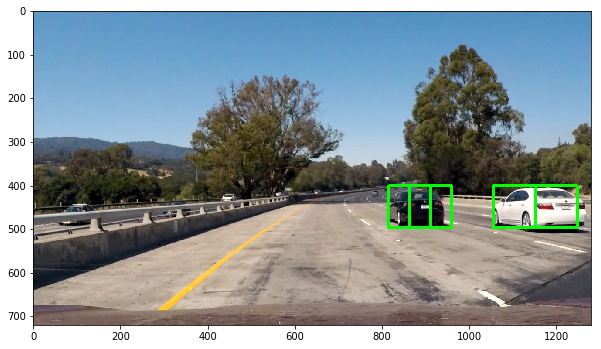
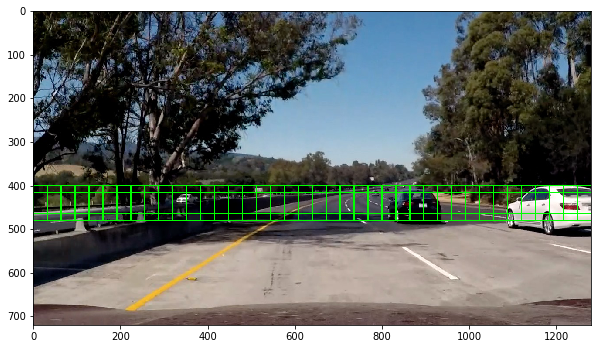
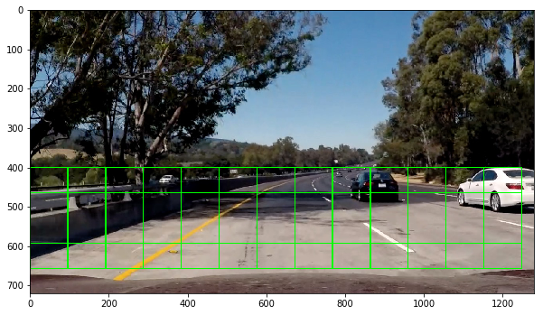
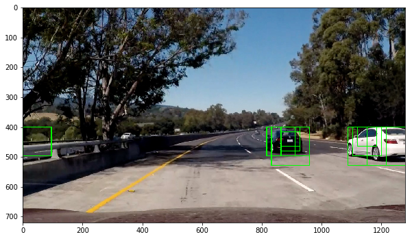
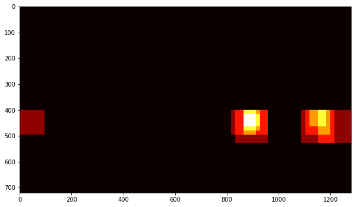
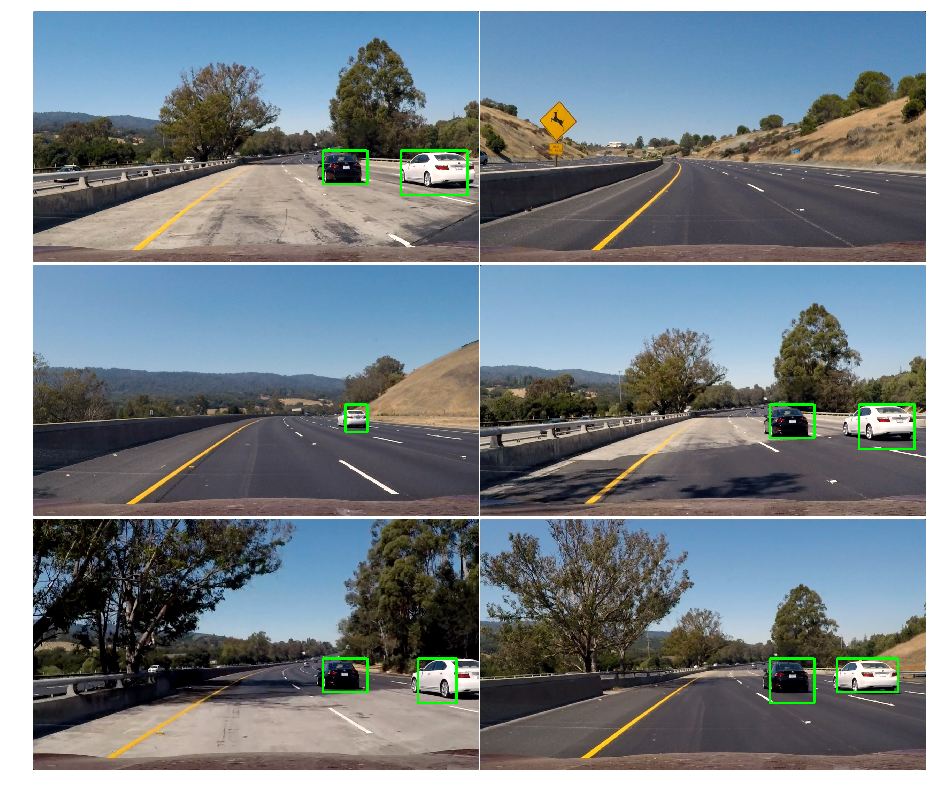

# Udacity Self Driving Car Nano Degree Project 5: Vehicle detection and tracking


---
## Project Goals

Main goal of this project is to create a software pipeline to detect and track vehicles in a video stream from a front facing camera of a car using computer vision and Machine Learning using the following steps:

1. Perform a Histogram of Oriented Gradients (HOG) feature extraction on a labeled training set of images and train a Linear SVM classifier. Optionally, you can also apply a color transform and append binned color features, as well as histograms of color, to your HOG feature vector.
2. Implement a sliding-window technique and use your trained classifier to search for vehicles in images.
3. Run your pipeline on a video stream (start with the test_video.mp4 and later implement on full project_video.mp4) and create a heat map of recurring detections frame by frame to reject outliers and follow detected vehicles.
4. Estimate a bounding box for vehicles detected.

The steps that I followed in this project are the following:

**Step 1:** Define helper functions and load Training data and Visualize some sample images.       
**Step 2:** Convert Image to HOG (Histogram of Oriented Gradients) and Visualize them using helper functions.          
**Step 3:** Extract Features for Input Datasets and Combine, Define Labels Vector, Shuffle and Split training data into training and testing sets.                 
**Step 4:** Pick a best combination of Color Space, Orientations, Pixels per cell to use in extracting the image features and train a classifier using SVM.                   
**Step 5:** Define methods to find cars using the Classifier and searching in the ROI, Apply Heatmap and thresholds to identify false positives, Draw bounding boxes around identified vehicles.                
**Step 6:** Build a pipeline combining the methods mentioned in step 5 and test it on sample images.           
**Step 7:** Define a class to store the identified bounding boxes from the previous video frame, build a pipeline for processing video frames.               
**Step 8:** Run the video through the pipeline.            

I have used the following software/libraries in this project

1. Python 3.5
2. Numpy
3. OpenCV
4. Matplotlib
5. Moviepy
6. SciKit
7. SciPy

## Detailed explanation of the steps followed

In this section I will go through each of the steps that I followed in this project.

### Step 1: Define helper functions and load Training data and Visualize some sample images

In this step I have defined functions ```get_hog_features``` ```bin_spatial``` and ```color_hist``` for features extraction (HOG, binned color and color histogram features) 

### Step 2: Convert Image to HOG (Histogram of Oriented Gradients) and Visualize them using helper functions

I have started by loading the training data and checked the number of images in both Cars and Non-Cars Classes and found that the number of images in both the classes are approximately same and hence no need for further data augumentation. Then I Visualized some sample images from both the classes.


**Explain how (and identify where in your code) you extracted HOG features from the training images.**

Then I have used the method ```get_hog_features``` using the following code snippet to extract hog features for a sample car image and non-car image. The figure below shows a comparison of a car image and its associated histogram of oriented gradients, as well as the same for a non-car image.

```
car_img = mpimg.imread(car_images[25])
_, car_dst = get_hog_features(car_img[:,:,2], 9, 8, 8, vis=True, feature_vec=True)
noncar_img = mpimg.imread(noncar_images[25])
_, noncar_dst = get_hog_features(noncar_img[:,:,2], 9, 8, 8, vis=True, feature_vec=True)

# Visualize 
f, ((ax1, ax2), (ax3, ax4)) = plt.subplots(2, 2, figsize=(7,7))
f.subplots_adjust(hspace = .4, wspace=.2)
ax1.imshow(car_img)
ax1.set_title('Car Image', fontsize=16)
ax2.imshow(car_dst, cmap='gray')
ax2.set_title('Car HOG', fontsize=16)
ax3.imshow(noncar_img)
ax3.set_title('Non-Car Image', fontsize=16)
ax4.imshow(noncar_dst, cmap='gray')
ax4.set_title('Non-Car HOG', fontsize=16)
```


### Step 3: Extract Features for Input Datasets and Combine, Define Labels Vector, Shuffle and Split training data into training and testing sets.

Here I have made use of ```extract_features``` method that accepts a list of image paths and HOG parameters and produces a flattened array of HOG features for each image in the list. I have experimented with multiple Color space, Orientation and pixels per cell combinations before choosing the best possible combination that is working for this project. 

**Explain how you settled on your final choice of HOG parameters.**

Initially I tested for the time taken for Feature Extraction for different combinations of Color space, Orientation and Pixels per cell with a sample of first 100 car and non-car images. Then I took from each color space one combination that takes moderate amount of time and one combination the takes least amount of time to extract the features and tried them for the entire training dataset to find the best possible training accuracy and training time to pick one possible combination that I think will work fine for the Vehicle detection and Tracking pipeline. Below is the list of combinations that I tried


| Colorspace | Orientations | Pixels_Per_Cell | 
|------------|--------------|-----------------| 
| RGB        | 9            | 8               | 
| RGB        | 11           | 16              | 
| HLS        | 9            | 8               | 
| HLS        | 11           | 16              | 
| HSV        | 10           | 8               | 
| HSV        | 11           | 16              | 
| LUV        | 9            | 8               | 
| LUV        | 11           | 16              | 
| YUV        | 9            | 8               | 
| YUV        | 11           | 16              | 
| YCrCb      | 9            | 8               | 
| YCrCb      | 11           | 16              | 
| LAB        | 10           | 8               | 
| LAB        | 10           | 16              | 

### Step 4: Pick a best combination of Color Space, Orientations, Pixels per cell to use in extracting the image features and train a classifier using SVM.

After training the classifier on all the above mentioned combinations, this is the summary of the results. Looking at the results below, one can say that clearly YUV Color space with 11 orientations and 16 Pixels per cell is the winner considering the very low training time and highest accuracy.

| Colorspace | Orientations | Pixels_Per_Cell | Feature_extract_time | Training_Time | Accuracy | 
|------------|--------------|-----------------|----------------------|---------------|----------| 
| RGB        | 9            | 8               | 182.32               | 17.38         | 96.85    | 
| RGB        | 11           | 16              | 133.65               | 3.09          | 97.07    | 
| HLS        | 9            | 8               | 183.36               | 8.16          | 98.17    | 
| HLS        | 11           | 16              | 146.95               | 1.83          | 97.47    | 
| HSV        | 10           | 8               | 185                  | 7.91          | 98.37    | 
| HSV        | 11           | 16              | 172.7                | 1.33          | 97.97    | 
| LUV        | 9            | 8               | 160.45               | 10.61         | 97.78    | 
| LUV        | 11           | 16              | 147.25               | 1.24          | 97.86    | 
| YUV        | 9            | 8               | 158.3                | 7.51          | 98.42    | 
| YUV        | 11           | 16              | 144.57               | 1.61          | 98.68    | 
| YCrCb      | 9            | 8               | 160.07               | 9.34          | 98.17    | 
| YCrCb      | 11           | 16              | 126.08               | 1.21          | 97.83    | 
| LAB        | 10           | 8               | 167.61               | 8.58          | 97.8     | 
| LAB        | 10           | 16              | 158.7                | 1.11          | 97.61    | 

Hence I have chosen YUV with 11 Orientations and 16 Pixels per cell as my Hog Parameters to train the SVM Classifier

**Describe how (and identify where in your code) you trained a classifier using your selected HOG features (and color features if you used them).**

In the section titled "Train a Classifier" I trained a linear SVM with the default classifier parameters and using HOG features alone and was able to achieve a test accuracy of 98.68%.

```
# Use a linear SVC 
svc = LinearSVC()
# Check the training time for the SVC
t = time.time()
svc.fit(X_train, y_train)
t2 = time.time()
print(round(t2-t, 2), 'Seconds to train SVC...')
# Check the score of the SVC
print('Test Accuracy of SVC = ', round(svc.score(X_test, y_test), 4))
# Check the prediction time for a single sample
t=time.time()
n_predict = 10
print('My SVC predicts: ', svc.predict(X_test[0:n_predict]))
print('For these',n_predict, 'labels: ', y_test[0:n_predict])
t2 = time.time()
print(round(t2-t, 5), 'Seconds to predict', n_predict,'labels with SVC')
```

### Step 5: Define methods to find cars using the Classifier and searching in the ROI, Apply Heatmap and thresholds to identify false positives, Draw bounding boxes around identified vehicles. 

I have defined a method ```find_cars``` that combines ```get_hog_features``` and a sliding window search, but rather than performing feature extraction on each window individually which can be time consuming, the HOG features are extracted for the entire region of interest in the image and then these full-image features are subsampled according to the size of the window and then fed to the classifier. The method performs the classifier prediction on the HOG features for each window region and returns a list of rectangle objects corresponding to the windows that generated a positive prediction.

Here is a sample image that uses ```find_cars``` with a single window size.



**Describe how (and identify where in your code) you implemented a sliding window search. How did you decide what scales to search and how much to overlap windows?**

Here is the code snippet used to generate the above image

```
test_img = mpimg.imread('./test_images/test5.jpg')

ystart = 400
ystop = 656
scale = 1.5
colorspace = 'YUV' # Can be RGB, HSV, LUV, HLS, YUV, YCrCb
orient = 11
pix_per_cell = 16
cell_per_block = 2
hog_channel = 'ALL' # Can be 0, 1, 2, or "ALL"

rectangles = find_cars(test_img, ystart, ystop, scale, colorspace, hog_channel, svc, None, orient, 
                       pix_per_cell, cell_per_block, None, None)

print(len(rectangles), 'rectangles found in image')
```

I explored several configurations of window sizes and positions, with various overlaps in the X and Y directions. The following images show the configurations of all search windows for 1x, 2x and 3x windows:

            
               
       

The final algorithm calls ```find_cars``` for each window scale and the rectangles returned from each method call are aggregated.  Overlap was set to 50% in both X and Y directions. Additionally, only an appropriate vertical range of the image is considered for each window size (e.g. smaller range for smaller scales) to reduce the chance for false positives in areas where cars at that scale are unlikely to appear. The final implementation is done with 190 window locations, which proved to be robust enough to reliably detect vehicles while maintaining a high speed of execution.

The image below shows the rectangles returned by ```find_cars``` drawn onto one of the test images in the final implementation. Notice that there are several positive predictions on each of the near-field cars, and one false positive prediction on a car in the oncoming lane.

 

Because a true positive is typically accompanied by several positive detections, while false positives are typically accompanied by only one or two detections, a combined heatmap and threshold is used to differentiate the two. The ```add_heat``` function increments the pixel value (referred to as "heat") of an all-black image the size of the original image at the location of each detection rectangle. Areas encompassed by more overlapping rectangles are assigned higher levels of heat. The following image is the resulting heatmap from the detections in the image above:

       

A threshold is applied to the heatmap (in this example, with a value of 1), setting all pixels that don't exceed the threshold to zero. The result is below:

 

### Step 6: Build a pipeline combining the methods mentioned in step 5 and test it on sample images. 

I have defined a method ```process_frame``` combining the ```find_cars``` along with sliding windows with multiple window sizes and ran the pipeline on all the test images. This produced the following result:

**Show some examples of test images to demonstrate how your pipeline is working. What did you do to optimize the performance of your classifier**



The final implementation performs very well, identifying the near-field vehicles in each of the images with no false positives.

The first implementation did not perform as well, so I began by optimizing the SVM classifier. The original classifier used HOG features from the RGB color space with 9 orientations and 8 pixels per cell, and achieved a test accuracy of 96.85%. Using YUV color space with all three channels increased the accuracy to 98.68%, also tripled the execution time. However, changing the pixels_per_cell parameter from 8 to 16 produced a roughly ten-fold increase in execution speed with minimal cost to accuracy.

### Step 7 & 8: Define a class to store the identified bounding boxes from the previous video frame, build a pipeline for processing video frames, Run the video through the pipeline. 

**Provide a link to your final video output. Your pipeline should perform reasonably well on the entire project video (somewhat wobbly or unstable bounding boxes are ok as long as you are identifying the vehicles most of the time with minimal false positives.)**

Here is a link to my final video [result ](https://youtu.be/mtT3lHNqlOQ)

I have defined a class ```Vehicle_Detect``` to store the detections returned by ```find_cars``` from the previous 15 frames of video using the ```prev_rects``` parameter. 

**Describe how (and identify where in your code) you implemented some kind of filter for false positives and some method for combining overlapping bounding boxes.**

The video processing pipeline is similar to the pipeline built for processing images except that it makes use of the ```Vehicle_Detect``` class to use the detections for the past 15 frames. These detections are combined and added to the heatmap and the threshold for the heatmap is set to ``` 1 + len(det.prev_rects)//2 ``` (one more than half the number of rectangle sets contained in the history) - this value was found to perform best empirically (rather than using a single scalar, or the full number of rectangle sets in the history).

---

### Discussion

#### 1. Briefly discuss any problems / issues you faced in your implementation of this project.  Where will your pipeline likely fail?  What could you do to make it more robust?

The problems that I faced while implementing this project were mainly concerned with detection accuracy. Balancing the accuracy of the classifier with execution speed was crucial. Scanning 190 windows using a classifier that achieves 98.68% accuracy should result in around 4 misidentified windows per frame. Of course, integrating detections from previous frames mitigates the effect of the misclassifications, but it also introduces another problem: vehicles that significantly change position from one frame to the next (e.g. oncoming traffic) will tend to escape being labeled. Producing a very high accuracy classifier and maximizing window overlap might improve the per-frame accuracy to the point that integrating detections from previous frames is unnecessary (and oncoming traffic is correctly labeled), but it would also be far from real-time without massive processing power.

The pipeline is probably most likely to fail in cases where vehicles don't resemble those in the training dataset, but lighting and environmental conditions might also play a role (e.g. a white car against a white background). As stated above, oncoming cars are an issue, as well as distant cars.

I believe that the best approach, given plenty of time to pursue it, would be to combine a very high accuracy classifier with high overlap in the search windows. The execution cost could be offset with more intelligent tracking strategies, such as:

* determine vehicle location and speed to predict its location in subsequent frames
* begin with expected vehicle locations and nearest (largest scale) search areas, and preclude overlap and redundant detections from smaller scale search areas to speed up execution
* use a convolutional neural network, to preclude the sliding window search altogether

